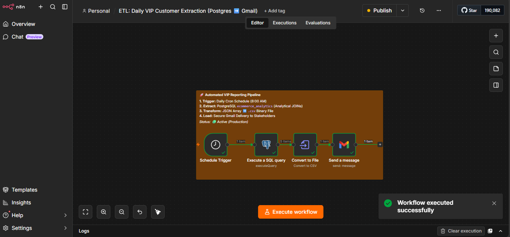

cat <<EOF >> README.md

## Automated ETL Pipeline & Orchestration
**Project:** "Daily VIP Customer Intelligence"

**Visual Architecture:**

**Objective:** Transition from manual data tasks to a self-executing, zero-touch ETL pipeline.

**Technical Execution:**
* **Orchestration:** Implemented a scheduled Cron trigger set to daily intervals, automating the retrieval of business intelligence without manual intervention.
* **Extraction:** Configured a secure network bridge between isolated Docker containers to query the containerized \`ecommerce_analytics\` PostgreSQL database.
* **Transform:** Executed high-order analytical SQL \`JOIN\` queries to aggregate relational data, subsequently serializing the JSON objects into standardized \`.csv\` binary formats.
* **Load & Delivery:** Integrated the Gmail API to automate the distribution of generated reports, ensuring stakeholders receive actionable data directly, fulfilling the final stage of the ETL lifecycle.
EOF